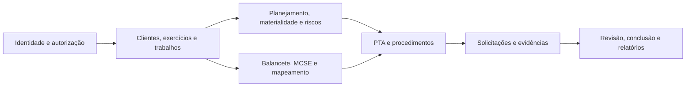

# SDD — Recuperação, Segurança e Finalização do AudiFlow

**Data:** 2026-07-13  
**Status:** escopo da V1 aprovado; documento em revisão  
**Tipo:** especificação recuperada do código, banco ativo, migrations e documentação  
**Sistema:** AudiFlow — sistema de auditoria e gestão de evidências

## 1. Resumo executivo

O AudiFlow já implementa parte substancial da operação de auditoria, mas cresceu sem uma especificação canônica, uma cadeia reproduzível de migrations ou uma suíte automatizada proporcional ao risco do produto. Esta SDD define sua recuperação incremental: preservar o valor existente, corrigir primeiro segurança e integridade e organizar o produto em contextos com contratos testáveis.

O ambiente ativo não deve ser considerado apto para produção ou dados reais até a conclusão da Onda 0. Uma simulação somente leitura com identidade de cliente confirmou acesso cruzado a clientes, trabalhos, balancetes, PTAs, solicitações e auditores. Também foram confirmadas RPCs antigas com grants indevidos e isolamento insuficiente de documentos no Storage.

## 2. Fontes e método

A especificação foi inferida e reconciliada a partir de:

- aplicação React/TypeScript em `src/`;
- 48 migrations em `supabase/migrations/` e scripts em `docs/sql/`;
- manuais em `docs/manual/`;
- `docs/Briefing.docx`, tratado como visão futura, não escopo automático da V1;
- roteiros de teste em DOCX e Markdown;
- build, typecheck, lint, testes e descoberta Playwright;
- inspeção somente leitura do catálogo, policies, funções, ACLs e advisors do Supabase ativo;
- simulações transacionais encerradas com `ROLLBACK`.

Quando código, documentação e banco divergem, vale a regra mais segura até decisão explícita.

## 3. Baseline observado

| Verificação | Estado |
|---|---|
| Build Vite | passa, com alerta de chunk grande |
| TypeScript | passa sob configuração não estrita |
| Testes automatizados | um teste tautológico; cobertura de domínio efetivamente zero |
| Lint | 920 erros e 33 avisos |
| Playwright | não inicia por dependência de configuração não declarada |
| Instalação limpa | `npm ci` falha por divergência de lockfile |
| CI/CD | não encontrado |
| Migrations remotas | histórico vazio no projeto ativo |
| Observabilidade/rollback | intenção documental, sem operação comprovada |

O frontend mistura UI, regras e acesso direto ao Supabase. Há operações compostas sem transação, erros mascarados, consultas sem paginação explícita, tipos desatualizados e dois clientes Supabase. O build atual não constitui evidência de correção funcional.

## 4. Escopo

### 4.1 V1 finalizável

- identidade, perfis e autorização;
- clientes, exercícios, contratos, produtos, equipes e trabalhos;
- planejamento, materialidade e riscos;
- balancete, MCSE e mapeamento;
- PTA e procedimentos;
- solicitações, portal do cliente e evidências;
- procedimentos existentes de caixa, estoque e faturas;
- revisão, conclusão e rastreabilidade mínima;
- testes, implantação, observabilidade e rollback.

### 4.2 Roadmap posterior

- SaaS para múltiplas firmas de auditoria;
- certificações ISO e programa ISQM completo;
- biblioteca integral de riscos da firma;
- independência e conflitos em profundidade;
- amostragem estatística avançada;
- arquivo probatório completo com hash e retenção regulatória;
- acesso externo de revisor independente;
- dashboards amplos e benchmarking.

O banco atual representa uma firma de auditoria e vários clientes. Multi-tenant entre firmas não faz parte da V1.

## 5. Objetivos e princípios

Objetivos:

- garantir isolamento por identidade, cliente e trabalho;
- reconstruir o banco exclusivamente pelo repositório;
- impedir estados e relacionamentos inválidos no servidor;
- tornar operações compostas atômicas ou compensáveis;
- preservar autoria, histórico e evidência;
- formalizar `risco → resposta → procedimento → PTA → evidência → conclusão`;
- permitir testes locais e em CI sem depender do ambiente ativo;
- estabelecer gates objetivos de homologação e produção.

Princípios:

1. **Default deny:** identidade ausente, inativa, ambígua ou sem vínculo recebe zero acesso.
2. **Servidor como autoridade:** autorização, transições, atores, timestamps e invariantes não dependem da UI.
3. **Escopo derivado do pai:** filhos herdam cliente/exercício do trabalho; chaves redundantes não ampliam acesso.
4. **Consistência:** falha intermediária não deixa importação, PTA, solicitação ou evidência parcialmente concluída.
5. **Preservação:** ações relevantes geram trilha append-only e exclusão destrutiva é limitada.
6. **Evolução incremental:** corrigir P0 antes de reorganizar módulos.
7. **Erro visível:** falha não vira silenciosamente lista vazia, zero ou sucesso parcial.
8. **Reprodutibilidade:** schema, dependências, seed, build e testes produzem o mesmo resultado localmente e em CI.

## 6. Arquitetura-alvo



Cada contexto recuperado separa gradualmente:

- `domain`: entidades, valores, cálculos, invariantes e máquinas de estado;
- `application`: comandos, consultas e casos de uso;
- `infrastructure`: Supabase, Storage, importadores e geradores;
- `ui`: páginas, componentes e adaptação de mensagens.

Devem existir comandos/RPCs estreitas para importar/remapear/excluir balancete, gerar/recalcular PTA, enviar solicitação, responder/analisar evidência e aprovar/reabrir artefatos. Cada comando valida autorização, estado anterior, invariantes, idempotência quando aplicável e resultado completo.

## 7. Identidade e autorização

Perfis reconhecidos: `anon`, autenticado sem vínculo, auditor ativo, administrador ativo, cliente ativo, identidade inativa e vínculo ambíguo. Administrador é uma especialização de auditor ativo.

Helpers canônicos:

```text
is_active_internal_auditor()
is_active_admin()
can_access_client(client_id)
can_access_work(work_id)
```

Regras:

- auditor acessa apenas trabalhos com participação ativa, salvo exceção formal;
- cliente acessa apenas seu cliente e artefatos explicitamente liberados;
- identidade sem vínculo, inativa ou ambígua acessa zero linhas;
- o mesmo `auth.uid()` não pode ser auditor e cliente sem modelo formal;
- nenhuma tabela sensível mantém `USING (true)` ou `WITH CHECK (true)`;
- policies derivam autorização do pai, não de ID gravável pelo chamador;
- `SECURITY DEFINER`, quando inevitável, usa `search_path = ''`, nomes qualificados e grants mínimos;
- funções internas não são executáveis por `PUBLIC` ou `anon`;
- a overload vulnerável de `link_auditor_account(uuid)` é removida;
- listagem de usuários de autenticação exige administrador ativo;
- path do Storage é validado contra item, solicitação, trabalho e cliente;
- MIME, tamanho e operações são restringidos;
- cliente não altera status, análise ou observação do auditor.

## 8. Integridade de dados

```text
cliente
└── exercício
    └── trabalho
        ├── planejamento / materialidade / riscos
        ├── balancetes / linhas
        ├── PTAs / linhas
        ├── solicitações / itens / documentos
        └── procedimentos / evidências / conclusões
```

Chaves redundantes devem ser removidas, protegidas por FK composta/constraint trigger ou preenchidas exclusivamente no servidor.

Invariantes mínimas:

- exercício e trabalho pertencem ao mesmo cliente;
- balancete, linhas, PTA e linhas mantêm escopo coerente;
- no máximo um responsável principal ativo por trabalho;
- materialidade vigente e bases respeitam unicidade, limite e alçada;
- `(solicitacao_item_id, versao)` é único e atribuído atomicamente;
- valores, percentuais e datas possuem checks;
- zero contado é diferente de não contado;
- códigos MCSE respeitam a estrutura aplicável;
- transições permitidas são validadas, não apenas o enum.

Criar `audit_events` append-only com identidade, papel, caso de uso, agregado, estado anterior/posterior, timestamp server-side, correlação e justificativa. Evidências de trabalho encerrado usam `RESTRICT`, legal hold, versionamento ou exclusão lógica.

## 9. Workflows e rastreabilidade

Cada workflow declara estados, transições, papéis, pré-condições, efeitos, campos mutáveis, reabertura e eventos. O frontend solicita; o servidor autoriza.

Solicitações devem cobrir elaboração, revisão, liberação ao cliente, recebimento, análise, aceite/rejeição/complemento e encerramento/reabertura. O portal só exibe e aceita resposta após liberação explícita. Upload, metadados e estado formam uma operação consistente.

Rastreabilidade mínima:

```text
risco identificado
→ avaliação
→ resposta de auditoria
→ procedimento planejado
→ PTA, executor e revisor
→ solicitação/evidência
→ resultado e exceção
→ conclusão
→ revisão/aprovação
```

Conclusão com procedimento/evidência obrigatória incompleta é bloqueada ou exige override com alçada, justificativa e evento.

## 10. Contratos técnicos

### Números e datas

Parsing não converte inválido em zero. Retorna sucesso ou erro estruturado com linha, coluna, entrada e motivo. Importação inválida não persiste estado parcial. Datas contábeis usam `LocalDate`/`YYYY-MM-DD`, sem `new Date(string)` para apresentação; instantes usam UTC.

### Consultas e cache

- paginação/lotes explícitos para volumes altos;
- KPIs agregados no servidor quando necessário;
- testes acima do limite padrão da API;
- falha permanece erro, não lista vazia;
- query keys incluem identidade/escopo e cache é descartado na troca de sessão.

### Tipos e configuração

- um único cliente Supabase configurado por ambiente;
- tipos regenerados após migrations, com drift bloqueando CI;
- TypeScript estrito ativado incrementalmente, começando por domínio e aplicação.

## 11. Estratégia de testes

### Unitários

Parsing, datas, materialidade, risco, totais, máquinas de estado, autorização pura e conclusão.

### Integração com banco local

Replay de migrations, constraints, RLS, RPCs, Storage, concorrência, rollback e volumes acima de mil registros.

### Frontend e E2E

Permissões, estados, erros, cache, formulários/importadores e negações da API. Fluxo E2E: trabalho → planejamento/risco → balancete/MCSE → PTA → solicitação → resposta do cliente → análise → conclusão/revisão.

### Matriz mínima de identidades

Testar SELECT/INSERT/UPDATE/DELETE, RPC e Storage com `anon`, sem vínculo, admin ativo/inativo, auditor ativo/inativo e alocado/não alocado, cliente A/B e vínculo ambíguo. Cobrir troca maliciosa de IDs, trabalho nulo, campo do auditor, autovinculação, upload cruzado e transição sem alçada.

O seed contém dois clientes, todos os perfis, auditor alocado/não alocado, balancete com mais de mil linhas, solicitações em estados relevantes e cenários concorrentes.

## 12. Recuperação de schema

Antes de promover alterações:

1. gerar backup e exportar o schema remoto completo;
2. inventariar tabelas, funções, policies, ACLs, triggers, constraints, índices e buckets;
3. comparar remoto, migrations e `docs/sql`;
4. escolher o estado canônico seguro;
5. produzir migrations ordenadas e idempotentes;
6. reconstruir um banco vazio;
7. comparar estruturalmente o banco reconstruído;
8. validar dados em cópia isolada.

Não aplicar cegamente as migrations locais no ativo: há policies remotas ausentes do repositório e correções locais que podem não remover shadow policies. Um ambiente novo deve ser criado por um único procedimento, sem SQL manual avulso.

## 13. Ondas de implementação

### Onda 0 — contenção P0

- congelar promoção funcional e restringir acesso externo/dados reais;
- revogar RPCs/grants vulneráveis;
- normalizar policies e Storage;
- auditar vínculos e alterações de documentos;
- capturar backup/baseline;
- criar teste de regressão para cada vulnerabilidade.

**Saída:** exposição fechada e comprovada por testes negativos.

### Onda 1 — fundação reproduzível

- escolher um gerenciador e lockfile;
- reparar instalação limpa;
- reconciliar schema/migrations/scripts;
- configurar Supabase local e seed;
- regenerar tipos;
- reparar Vitest/Playwright;
- criar CI com build, lint, typecheck, testes e drift checks.

**Saída:** clone limpo instala, reconstrói o banco e executa a suíte.

### Onda 2 — integridade do núcleo

- corrigir hierarquia cliente–exercício–trabalho;
- implementar comandos transacionais;
- corrigir parsing, datas, paginação, erros e cache;
- versionar documentos atomicamente;
- adicionar trilha e proteção de evidência.

**Saída:** operações críticas não geram estado parcial ou relação incoerente.

### Onda 3 — workflow e rastreabilidade

- formalizar estados, transições e alçadas;
- fechar o portal do cliente;
- ligar risco–resposta–PTA–evidência–conclusão;
- implementar gates de revisão/conclusão;
- concluir caixa, estoque e faturas no mesmo padrão.

**Saída:** ciclo prioritário rastreável ponta a ponta.

### Onda 4 — homologação e liberação

- automatizar cenários manuais prioritários;
- executar E2E, volume e concorrência;
- operacionalizar observabilidade, backup e rollback;
- atualizar manuais e permissões;
- executar homologação e decisão go/no-go.

**Saída:** release candidate com evidência objetiva.

## 14. Gates de liberação

### Segurança

- zero policies sensíveis sempre verdadeiras;
- zero função interna `SECURITY DEFINER` executável por `anon`/`PUBLIC`;
- sem vínculo/inativo retorna zero linhas;
- acesso cruzado e Storage cruzado negados;
- advisors críticos tratados ou justificados.

### Reprodutibilidade

- instalação limpa passa;
- banco vazio nasce apenas de migrations versionadas;
- ambiente e repositório têm o mesmo histórico;
- tipos estão sincronizados;
- nenhum script manual completa o schema.

### Qualidade e operação

- build, lint, typecheck e testes passam em CI;
- invariantes críticas têm cobertura explícita;
- E2E principal, rollback, concorrência e volume passam;
- backup/restauração e rollback foram ensaiados;
- logs, alertas, runbook e responsáveis estão ativos;
- homologação possui evidência versionada.

## 15. Critérios de aceite críticos

### Isolamento

**Dado** um usuário do cliente A, **quando** consultar ou alterar recurso do cliente B, **então** recebe zero linhas ou erro sem revelar metadados.

### Sem vínculo

**Dado** um autenticado sem vínculo ativo, **quando** consultar tabela operacional ou RPC interna, **então** recebe zero acesso e não consegue criar vínculo privilegiado.

### Importação atômica

**Dado** balancete com valor inválido ou falha intermediária, **quando** importar, **então** não resta importação parcialmente concluída e o erro aponta linha, coluna e valor.

### Concorrência documental

**Dado** o mesmo item em duas sessões, **quando** ambas enviarem documento, **então** versões são únicas/ordenadas, sem sobrescrita ou metadado órfão.

### Workflow

**Dado** estado que não permite envio/aprovação, **quando** tentarem pular transição, **então** o servidor rejeita e registra quando relevante.

### Conclusão

**Dado** risco com procedimento/evidência incompleta, **quando** concluir o trabalho, **então** bloqueia ou exige override com alçada, justificativa e evento.

### Reconstrução

**Dado** banco vazio e clone limpo, **quando** executar bootstrap, **então** aplicação, schema, policies, buckets, seed e testes ficam operacionais sem SQL manual.

## 16. Riscos e decisões pendentes

| Risco | Mitigação |
|---|---|
| RLS correta interromper telas dependentes de acesso amplo | testes por papel e rollout isolado |
| remoto divergir das migrations | baseline, diff e migration de normalização |
| regras existirem apenas no comportamento | converter roteiros em exemplos e ADRs |
| reorganização atrasar P0 | segurança antes da refatoração |
| dados violarem novas constraints | relatório, saneamento versionado e validação |
| estado parcial já existir | inventário e reparo auditável |
| Briefing ampliar indevidamente a V1 | roadmap e ADR obrigatório |

Decisões a registrar antes das ondas correspondentes:

- alcance de admin, sócio e gerente;
- alçadas/transições exatas;
- retenção, legal hold e descarte de evidência;
- extensões, MIME e tamanhos aceitos;
- procedimentos obrigatórios por modalidade;
- relatórios mínimos da V1;
- ambiente e responsáveis pela homologação.

## 17. Definition of Done da V1

A V1 é finalizável quando:

1. todos os gates obrigatórios estiverem verdes;
2. o fluxo principal estiver rastreável do planejamento à conclusão;
3. operações críticas forem atômicas ou compensáveis;
4. a matriz de identidades tiver testes positivos e negativos;
5. o schema remoto puder ser reconstruído pelo repositório;
6. homologação ocorrer em ambiente isolado com dados controlados;
7. documentação, código, banco e testes descreverem o mesmo comportamento;
8. riscos residuais tiverem responsável, aceite e prazo.

## 18. Recomendação final

Adotar recuperação incremental: contenção, baseline reproduzível, integridade, workflow/rastreabilidade e homologação. Reescrita completa aumenta o risco de perder regras existentes; apenas adicionar testes congelaria vulnerabilidades confirmadas.

Até a conclusão da Onda 0, o ambiente ativo deve ser tratado como potencialmente exposto. A prioridade é impedir acesso cruzado, remover elevação de perfil e preservar evidências antes de continuar funcionalidade.

## 19. Referências

- `docs/manual/00-visao-geral.md`
- `docs/manual/04-manual-tecnico.md`
- `docs/manual/05-dicionario-dados.md`
- `docs/manual/06-matriz-permissoes-rls.md`
- `docs/manual/07-fluxos-status.md`
- `docs/manual/08-roteiro-testes.md`
- `docs/manual/09-runbook-implantacao.md`
- `docs/manual/10-backlog-e-dividas-tecnicas.md`
- `docs/manual/11-inventario-p0-supabase.md`
- `docs/sql/security-fix-rls-shadow-policies.sql`
- `supabase/migrations/`
- `docs/Briefing.docx`
- `docs/ROTEIRO DE TESTES.docx`
